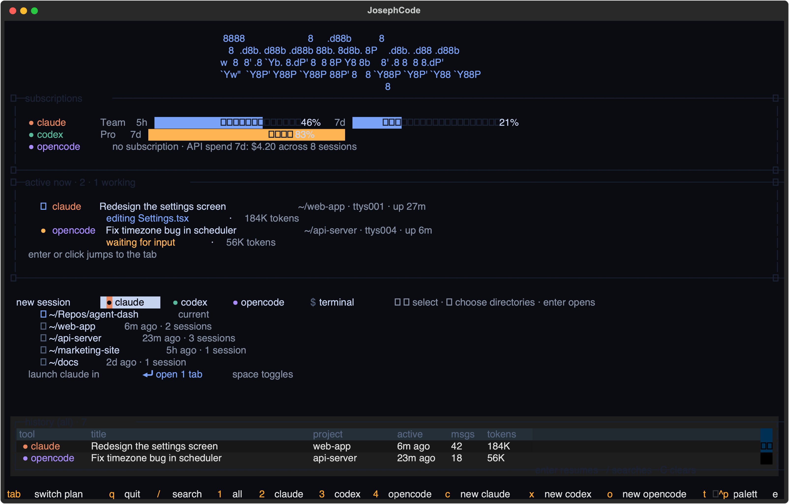

# agent-dash

One terminal dashboard for your Claude Code, Codex, and OpenCode sessions:
subscription usage, agents running right now, and your full searchable
history, all in one place.



## Features

- **Subscriptions at a glance.** Claude usage windows (5-hour and 7-day, with
  multi-account support), Codex rate-limit windows, and OpenCode 7-day API
  spend, with color-coded bars as you warm up.
- **Active now.** A live view of every agent actually running on your machine:
  working / waiting / idle state, the file or command it's on, and live token
  counts. Hit enter or click a row to jump straight to that agent's Warp tab.
- **Launch new sessions.** Start claude, codex, opencode, or a plain shell in
  Warp tabs, in one directory or several at once, straight from the dashboard.
- **Searchable history.** Every session from all three tools in one table.
  Filter by tool, search titles and projects, hit enter, and get the exact
  command to resume that session where you left off.
- **Wrap-proof banner.** The figlet logo measures itself against the terminal
  and steps down to a smaller font or plain text, so it never shreds. It also
  sticks to ligature-safe fonts and regular weight, because coding fonts merge
  pairs like `\/` and `__` into single glyphs and synthesized bold smears
  dense ASCII art.

## Requirements

- **macOS.** Claude's OAuth token is read from the macOS Keychain, and
  sessions are launched with `open`.
- **Python 3.10+**
- **[Warp](https://warp.dev)** for the new-session launcher (it drives
  `warp://tab_config/...`). The rest of the dashboard works in any terminal.
- The CLIs you want to track: `claude`, `codex`, and/or `opencode`, with some
  existing sessions for the dashboard to show.

## Install

```sh
git clone https://github.com/josephtutera/agent-dash.git
cd agent-dash
pip install .
adash
```

For development, use a virtualenv and the editable install:

```sh
python3 -m venv .venv
source .venv/bin/activate
pip install -e '.[dev]'
```

## Usage

```sh
adash                # launch the dashboard
adash --dump         # print sessions as text, no TUI
adash --usage        # print subscription usage as text, no TUI
adash --limit 500    # max sessions to scan per tool (default 300)
```

`adash --cmd-file PATH` is meant for a shell wrapper: when you pick a session,
the resume command is written to PATH instead of printed, so your shell can
run it in the current terminal. For example, in `.zshrc`:

```sh
adash() {
  local f="$(mktemp)"
  command adash --cmd-file "$f"
  [[ -s "$f" ]] && eval "$(cat "$f")"
  rm -f "$f"
}
```

### Keys

| Key | Action |
| --- | --- |
| `1`–`4` | filter history: all / claude / codex / opencode |
| `/` | search titles, prompts, projects (`esc` to close) |
| `c` `x` `o` | new claude / codex / opencode session |
| `t` | new plain terminal |
| `tab` | switch the active Claude plan (multi-account) |
| `C` / `u` | clear history / undo |
| `r` | refresh |
| `q` | quit |

In the launcher: arrow keys select, `space` toggles directories, `enter` opens
the tabs. In the active-now list, `enter` (or a click) jumps to that agent's
Warp tab. The first time you jump, macOS will ask you to grant Warp
Accessibility access so the dashboard can switch tabs for you; without it,
Warp still comes to the front but you'll pick the tab yourself.

## Where the data comes from

Everything the dashboard shows is read from data already on your machine:

- **Sessions** are parsed from the files each CLI keeps locally:
  `~/.claude/projects` (Claude Code), `~/.codex` (rollouts and history), and
  OpenCode's sqlite database.
- **Claude usage** comes from the same OAuth usage endpoint the `/usage`
  command calls, using the OAuth token Claude Code stores in the macOS
  Keychain. **Codex usage** comes from rate-limit snapshots embedded in local
  rollout files, and **OpenCode spend** is summed from its local database, so
  neither of those needs a network call.

Nothing is sent anywhere except that single usage request to Anthropic, made
with your own token. There are no third-party analytics, and nothing is
uploaded.

## Development

```sh
pytest                       # run the test suite
python scripts/screenshot.py # regenerate adash.svg + adash.png with demo data
```

The screenshot script renders the app headlessly against synthetic sessions
and usage, so the images in this README never contain real session data.

## License

[MIT](LICENSE)
